# Market Regime Capstone

**Predict Market Regimes before Price Prediction**

| | |
|---|---|
| **Author** | Sanam Jan |
| **Universe** | SPY (S&P 500 ETF), daily bars **2000–2024** |
| **Thesis model** | PatchTST + **FiLM** regime conditioning |
| **Control** | Identical PatchTST **without** regimes |
| **Date** | July 2026 |

**Hypothesis:** Soft regime conditioning (Feature-wise Linear Modulation / FiLM driven by causal HMM posteriors) improves out-of-sample Sharpe versus an identical regime-agnostic PatchTST.

**Result (honest negative):** On the official walk-forward ablation (**2011–2021**) and the locked final holdout (**2022–2024**), **FiLM does not beat the no-regime control.** Buy & Hold remains the strongest simple OOS Sharpe baseline. Soft FiLM still beats hard-switching.

Pipeline:

```text
data → features → causal HMM regimes → PatchTST (± FiLM) → cost-aware Kelly-lite strategy
      → purged walk-forward ablation → bootstrap CI / Deflated Sharpe → final holdout (once)
```

Methodology follows Lopez de Prado (2018), *Advances in Financial Machine Learning*.

---

## Preview

<p align="center">
  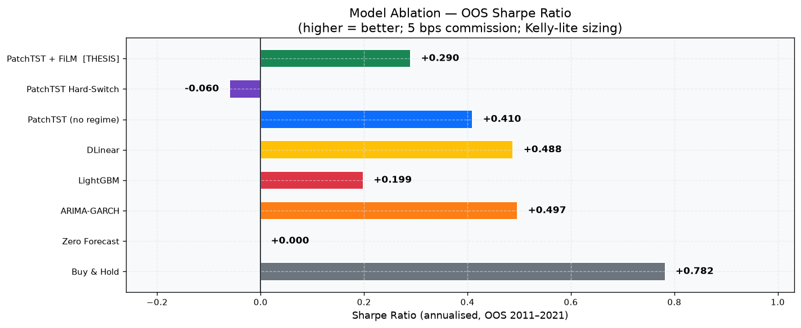
  <br/>
  <em>Figure 1 — Model ablation: OOS Sharpe (2011–2021)</em>
</p>

<p align="center">
  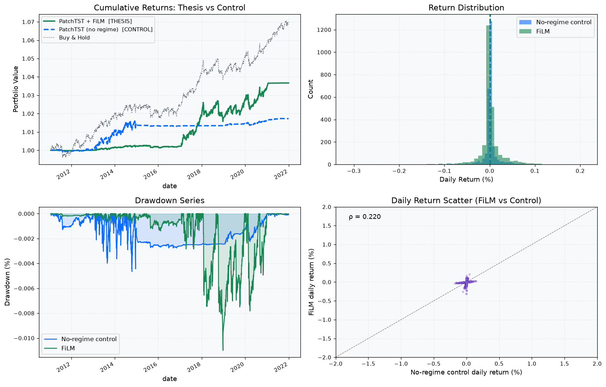
  <br/>
  <em>Figure 2 — Thesis comparison: PatchTST + FiLM vs no-regime control</em>
</p>

---

## Key results

### Table 1 — Walk-forward OOS ablation (2011–2021)

Source: [`reports/ablation_table.csv`](reports/ablation_table.csv)  
(~5 bps round-trip costs, Kelly-lite sizing, *n* ≈ 2,693)

| Rank | Model | Sharpe | Sortino | Max DD | Ann. return | Hit rate |
|-----:|-------|-------:|--------:|-------:|------------:|---------:|
| 1 | Buy & Hold | **0.782** | 0.896 | −35.7% | 13.3% | 0.557 |
| 2 | ARIMA–GARCH | 0.497 | 0.554 | ≈0%* | ≈0%* | 0.540 |
| 3 | DLinear | 0.488 | 0.545 | −1.6% | 0.5% | 0.525 |
| 4 | PatchTST no-regime (**control**) | **0.410** | 0.405 | −18.0% | 2.8% | 0.540 |
| 5 | PatchTST + FiLM (**thesis**) | **0.290** | 0.288 | −17.6% | 1.9% | 0.555 |
| 6 | LightGBM | 0.199 | 0.273 | −1.2% | 0.1% | 0.476 |
| 7 | Zero forecast | 0.000 | 0.000 | 0% | 0% | — |
| 8 | PatchTST hard-switch | **−0.060** | −0.067 | −13.3% | −0.3% | 0.508 |

\*ARIMA–GARCH Sharpe reflects very low exposure / scale, not an equity-like return stream.

**Architecture delta (OOS):** Sharpe(FiLM) − Sharpe(control) = **−0.120**

<p align="center">
  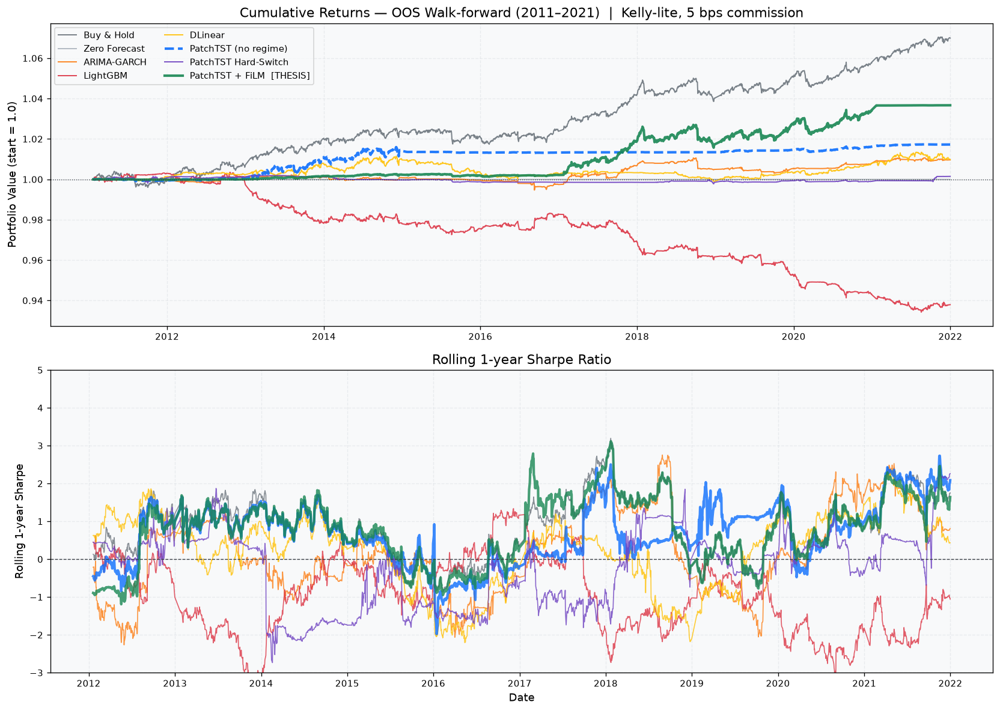
  <br/>
  <em>Figure 3 — Cumulative net returns (OOS 2011–2021)</em>
</p>

<p align="center">
  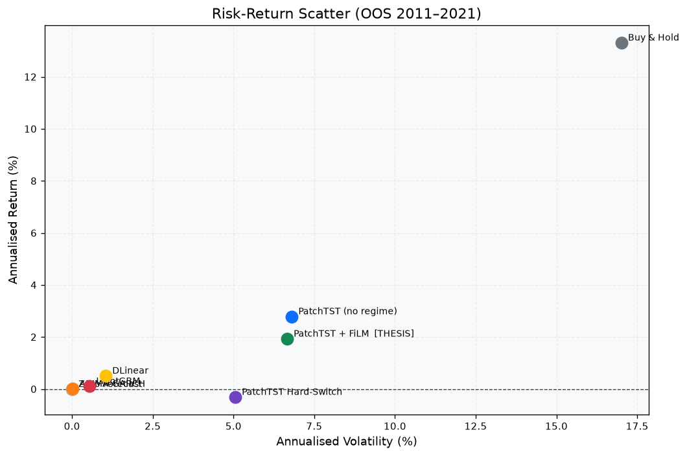
  <br/>
  <em>Figure 4 — Risk–return snapshot across models</em>
</p>

### Table 2 — Final holdout (2022–2024, touched once)

Source: [`reports/final_holdout_summary.csv`](reports/final_holdout_summary.csv)

| Rank | Model | Sharpe | Ann. return |
|-----:|-------|-------:|------------:|
| 1 | PatchTST no-regime | **0.724** | 0.50% |
| 2 | Buy & Hold | 0.684 | 0.47% |
| 3 | ARIMA–GARCH | 0.467 | 0.11% |
| 4 | DLinear | 0.035 | ≈0% |
| 5 | Zero | 0.000 | 0% |
| 6 | PatchTST + FiLM | **−0.145** | ≈0% |
| 7 | LightGBM | −0.174 | −0.09% |

**Holdout thesis delta:** FiLM trails the control by **≈ 0.87 Sharpe**.

<p align="center">
  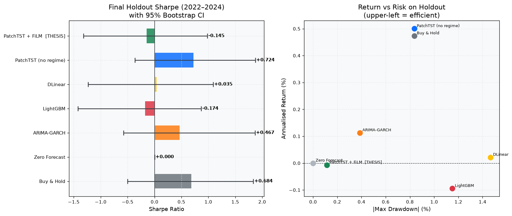
  <br/>
  <em>Figure 5 — Locked final holdout (2022–2024)</em>
</p>

### Table 3 — Transaction cost sensitivity

Source: [`reports/sensitivity_costs.csv`](reports/sensitivity_costs.csv)  
A strategy must survive **10 bps** round-trip to be considered viable in this study.

| Model | Sharpe @ 0 bps | @ 5 bps | @ 10 bps | @ 20 bps | Survives 10 bps? |
|-------|---------------:|--------:|---------:|---------:|:----------------:|
| Buy & Hold | 0.892 | 0.846 | **0.800** | 0.709 | Yes |
| PatchTST + FiLM | 0.753 | 0.717 | **0.681** | 0.608 | Yes |
| PatchTST no-regime | 0.538 | 0.502 | **0.467** | 0.397 | Yes |
| ARIMA–GARCH | 0.410 | 0.300 | **0.189** | −0.034 | Yes |
| Hard-switch | 0.256 | 0.110 | −0.035 | −0.324 | No |
| DLinear | 0.613 | 0.224 | −0.165 | −0.935 | No |
| LightGBM | −0.385 | −0.927 | −1.460 | −2.487 | No |

> Note: cost-sensitivity Sharpes come from reconstructed paths and can differ numerically from Table 1; use **Table 1 + Table 2** as the official thesis ranking.

<p align="center">
  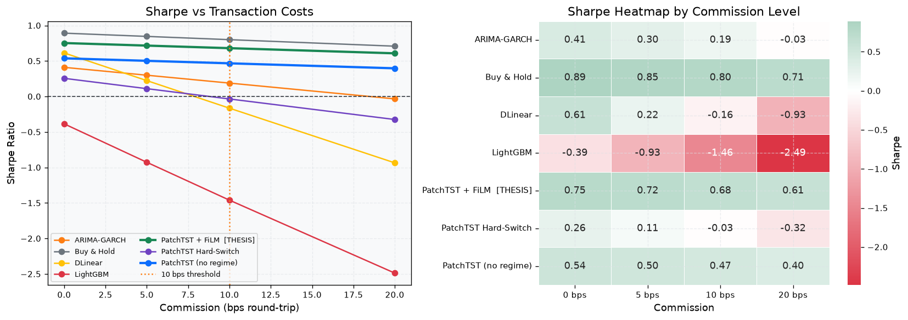
  <br/>
  <em>Figure 6 — Sharpe vs transaction costs</em>
</p>

### Table 4 — Per-regime P&L attribution (FiLM, OOS)

Source: [`reports/regime_attribution.csv`](reports/regime_attribution.csv)

| Regime | % time | Sharpe | Hit rate | Reading |
|--------|-------:|-------:|---------:|---------|
| Low-vol bull | 6.4% | −0.36 | 0.47 | Weak in calm bull |
| Transition | 55.3% | +0.03 | 0.49 | Near flat (most time) |
| High-vol bear | 38.3% | +0.19 | 0.52 | Mild positive in stress |

<p align="center">
  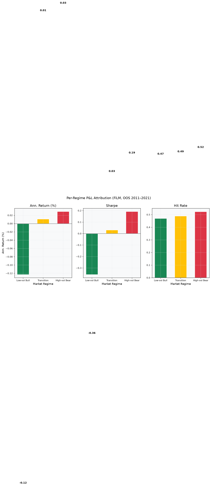
  <br/>
  <em>Figure 7 — Per-regime P&L attribution</em>
</p>

### Table 5 — Evaluation scorecard

| Check | Finding | Artefact |
|-------|---------|----------|
| Cost sensitivity | FiLM & no-regime survive 10 bps; Buy & Hold most robust | Table 3 / Fig 6 |
| Regime P&L | Weak in bull/transition; mild positive in high-vol bear | Table 4 / Figure 7 |
| FiLM γ/β | Parameters **diverge** across regimes (mechanism active) | Figure 10 |
| Bootstrap / DSR | Wide CIs; Deflated Sharpe ≈ 0 after multiple testing | Figure 8 |
| Leakage sanity | Shuffled-label Sharpe ≈ 0 | Figure 9 |

---

## Additional figures

### Experimental design & market regimes

<p align="center">
  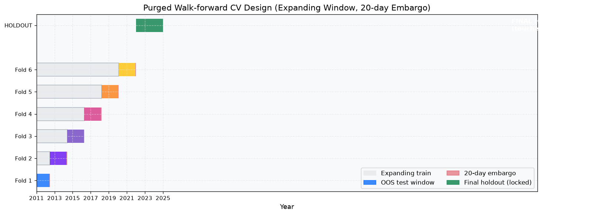
  <br/>
  <em>Figure 8a — Purged walk-forward CV + locked holdout design</em>
</p>

<p align="center">
  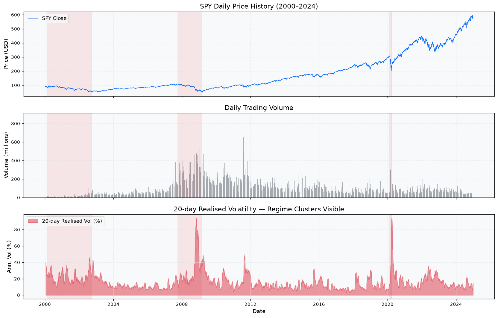
  <br/>
  <em>Figure 8b — SPY price / return overview (2000–2024)</em>
</p>

<p align="center">
  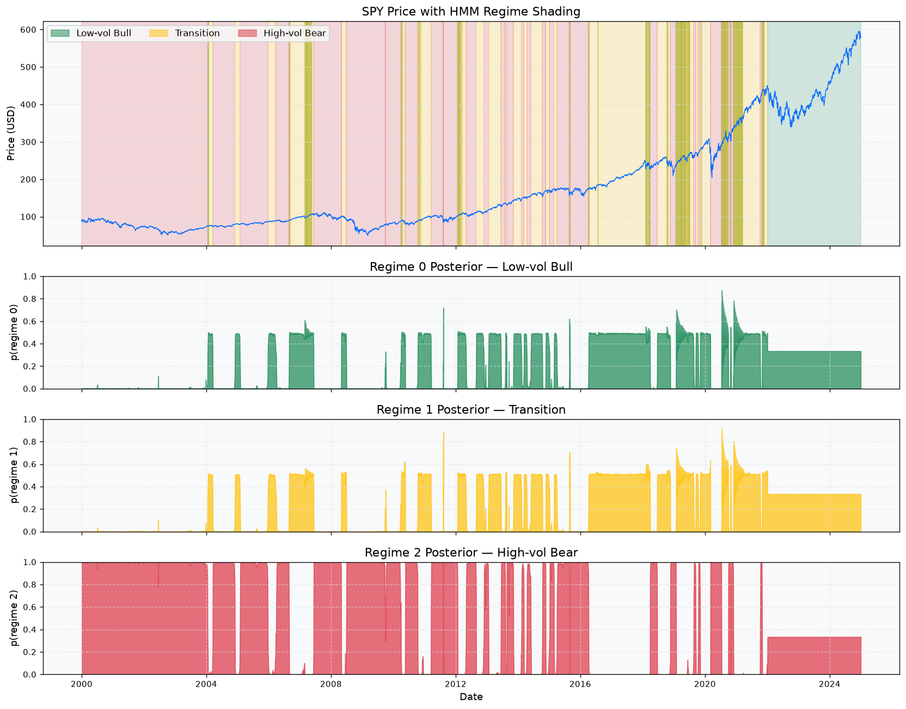
  <br/>
  <em>Figure 8c — Causal HMM regime detection overlay</em>
</p>

<p align="center">
  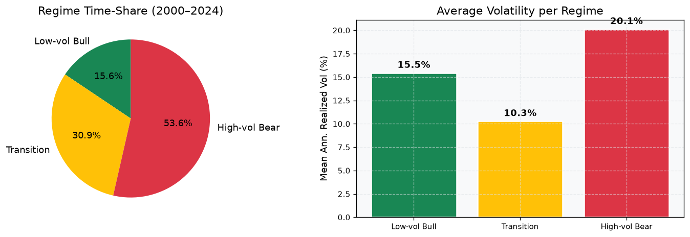
  <br/>
  <em>Figure 8d — Per-regime return / volatility statistics</em>
</p>

### Statistical rigor & FiLM interpretability

<p align="center">
  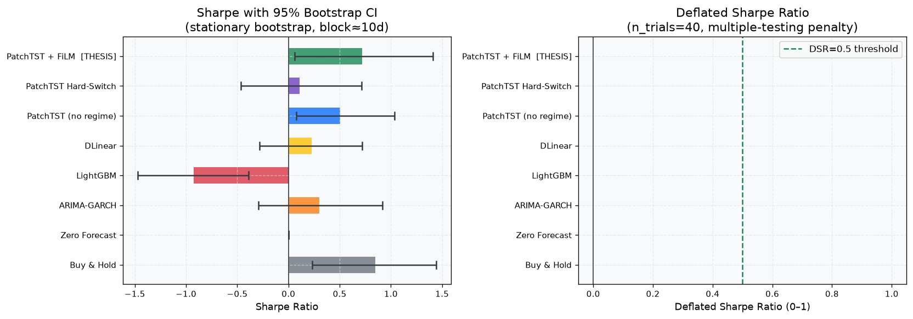
  <br/>
  <em>Figure 9 — Bootstrap Sharpe CI & Deflated Sharpe Ratio</em>
</p>

<p align="center">
  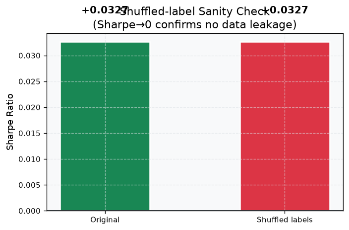
  <br/>
  <em>Figure 10 — Shuffled-label sanity check (no leakage)</em>
</p>

<p align="center">
  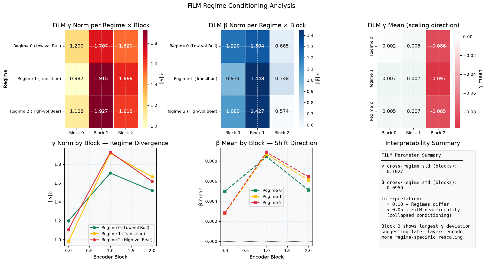
  <br/>
  <em>Figure 11 — FiLM γ / β by regime × encoder block</em>
</p>

### Figure index

| Figure | File | Description |
|--------|------|-------------|
| 1 | [`fig_ablation_sharpe.png`](reports/fig_ablation_sharpe.png) | OOS Sharpe bar chart |
| 2 | [`fig_thesis_comparison.png`](reports/fig_thesis_comparison.png) | FiLM vs no-regime control |
| 3 | [`fig_cumulative_returns.png`](reports/fig_cumulative_returns.png) | Cumulative OOS equity curves |
| 4 | [`fig_risk_return.png`](reports/fig_risk_return.png) | Risk–return scatter |
| 5 | [`fig_final_holdout.png`](reports/fig_final_holdout.png) | Locked 2022–2024 results |
| 6 | [`fig_cost_sensitivity.png`](reports/fig_cost_sensitivity.png) | Sharpe vs commission |
| 7 | [`fig_regime_attribution.png`](reports/fig_regime_attribution.png) | Per-regime P&L |
| 8a–d | `fig_cv_design`, `fig_spy_overview`, `fig_regime_detection`, `fig_regime_stats` | Design & regimes |
| 9–11 | `fig_bootstrap_dsr`, `fig_shuffled_label`, `fig_film_interpretability` | Stats & FiLM |

---

## Repository layout

```text
conf/                 # Hydra configs (data, model, CV, backtest)
data/
  raw/                # downloaded inputs (gitignored)
  processed/          # features / folds (gitignored)
notebooks/            # EDA, evaluation notebook, architecture PDF, suggestions docs
reports/              # CSV/JSON summaries + PNG figures (committed)
scripts/              # CLI entrypoints
src/
  data/               # loaders, PIT alignment
  features/           # engineering, fracdiff, scalers, purged CV
  regimes/            # HMM, causal filtering, validation
  models/             # PatchTST, FiLM, DLinear, hard-switch, baselines
  backtest/           # engine, costs, sizing, metrics
  eval/               # ablation, bootstrap, DSR, FiLM interpretability
tests/                # leakage / unit tests (non-negotiable)
outputs/              # Hydra run dirs (gitignored)
```

### Model configs (`conf/model/`)

| Config | Role |
|--------|------|
| `patchtst_film` | **Thesis** — PatchTST + FiLM |
| `patchtst_no_regime` | **Control** — same backbone, no regimes |
| `patchtst_hard_switch` | Soft vs hard conditioning ablation |
| `patchtst_cross_attn` | Alternative soft conditioning |
| `patchtst_pinball` | Quantile / pinball head |
| `dlinear` | Strong linear time-series baseline |

Classical baselines (Buy & Hold, zero, ARIMA–GARCH, LightGBM) are run via `scripts/run_baselines.py`.

---

## Setup

**Python:** ≥ 3.10

```bash
git clone <your-repo-url> market-regime-capstone
cd market-regime-capstone

python -m venv .venv
source .venv/bin/activate          # Windows: .venv\Scripts\activate

pip install -e ".[dev]"
# or: pip install -r requirements.txt && pip install -e .
```

---

## Quick start

```bash
# 1) Download & align data (SPY + FRED / cross-asset; BTC optional)
python scripts/download_data.py

# 2) Build features + purged walk-forward folds
python scripts/build_features.py

# 3) Fit regimes (causal filtered posteriors — no look-ahead smoothing)
python scripts/fit_regimes.py

# 4) Train models (Hydra overrides)
python scripts/train.py model=patchtst_film
python scripts/train.py model=patchtst_no_regime
python scripts/train.py model=dlinear
python scripts/train.py model=patchtst_hard_switch

# 5) Classical baselines
python scripts/run_baselines.py

# 6) Ablation table + backtest + statistical evaluation
python scripts/run_ablation.py
python scripts/backtest.py
python scripts/evaluate.py

# 7) Cost curves, FiLM interpretation helpers, locked holdout
python scripts/sensitivity.py
python scripts/final_holdout.py

# Optional: BTC robustness
python scripts/btc_robustness.py
```

```bash
pytest tests/ -q
```

Open notebooks after artefacts exist under `reports/`:

```bash
jupyter notebook notebooks/01_EDA_stylised_facts.ipynb
jupyter notebook notebooks/02_Model_Results_and_Evaluation.ipynb
```

---

## Critical correctness rules

1. HMM posteriors must be **filtered** (`src/regimes/filtering.py`), never smoothed `predict_proba`.
2. Refit HMM / scalers **per walk-forward fold** on train only.
3. Use **purged expanding CV + embargo**; final holdout **2022–2024** is touched **exactly once**.
4. Execute at **next open**; include commissions (and impact where configured).
5. Ablation heart: Transformer **without** regime vs **with** FiLM — same backbone.
6. Prefer **Deflated Sharpe** and bootstrap CIs when comparing many models; do not oversell point Sharpe.

---

## Reports directory (committed summaries)

| File | Description |
|------|-------------|
| `ablation_table.csv` | Official OOS model ranking (Table 1) |
| `final_holdout_summary.csv` / `final_holdout.json` | Locked 2022–2024 metrics (Table 2) |
| `sensitivity_costs.csv` | Sharpe vs 0 / 5 / 10 / 20 bps (Table 3) |
| `regime_attribution.csv` | Per-regime strategy attribution (Table 4) |
| `film_params.csv` / `film_divergence.csv` | FiLM interpretability |
| `eval_summary.json` | Bootstrap CI, DSR, shuffle check |
| `backtest_metrics.json` | Backtest summary metrics |
| `fig_*.png` | Evaluation figures shown above |

Heavy artefacts (`*.parquet`, `predictions/`, Hydra `outputs/`, weight `*.pt`) are **not** committed — regenerate with the scripts above.

---

## Suggestions & future work (summary)

See also [`Capstone_Review_Report.md`](Capstone_Review_Report.md) for the full written review.

**Near term**
- Reconcile ablation vs cost-sensitivity Sharpe sources; audit holdout regime exports
- Confidence-gated FiLM (fallback to no-regime when posterior entropy is high)
- Vol-targeted Buy & Hold as a fairer economic baseline
- Diebold–Mariano / SPA tests for forecast skill vs trading Sharpe

**Model improvements**
- Cross-attention or LoRA/adapters instead of full FiLM capacity
- Pinball / multi-horizon heads; curriculum (pretrain no-regime → freeze → FiLM)
- Richer HMM inputs (VIX, credit, breadth); 2-/4-state selection by BIC on train only

**Future**
- BTC hourly + multi-asset robustness
- Online / Bayesian HMM for 2022–2024 non-stationarity
- Capacity / turnover studies

---

## Citation / reference

If you use this repository, please credit the author and cite:

> López de Prado, M. (2018). *Advances in Financial Machine Learning*. Wiley.

---

## License

Capstone academic project — see repository license (if present) or contact the author for reuse terms.
